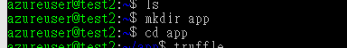
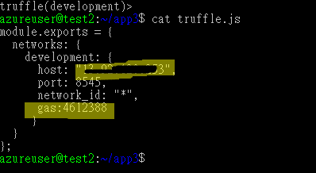
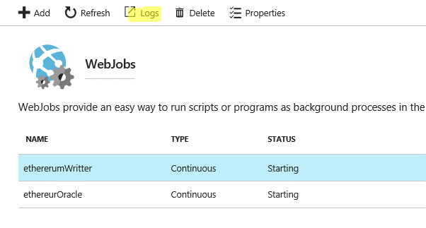

@blockchainsupplychainiot

IOT Ethereum Hands-on Kit
=========================

How to use
----------

This hands-on kit is to guide developers to create an IoT/Blockchain end-to-end
prototype. This document does not intent to discuss what scenario this demo fits
into, does not intent to discuss security tasks in any aspect.

All services are created on Azure including Ethereum network and IoT solution,
however, you can create Ethereum network in your own environment as long as your
application has access to it.

Prerequisites
-------------

In order to follow this document to create this prototype, we use below tools to
develop, manage and deploy solutions.

-   Visual Studio 2017 (Community or above) required to compile Device
    simulator

-   Service Bus Explorer !V for testing

-   Visual Studio Code (or other Solidity and Node.Js editor)

-   Active Azure Subscription

-   Windows or Linux machine

-   Truffle 3.3

You can use any Node.Js editor

Scenario
--------

In this demo, we will be creating an IoT solution that collects environment
metrics such as temperature, humidity, pm2.5!Ketc. When certain criteria are met,
for example, temperature or humidity higher than a threshold, the IoT solution
writes abnormal telemetry to Ethereum Blockchain.

Below illustrates telemetry will be sending to IoT Hub by device simulator.


Note that you can change any index above to fit your scenario.

Architecture
------------

Below illustrates architecture of this prototype


References
==========
Azure Web Job: <https://github.com/projectkudu/kudu/wiki/WebJobs>

Service Bus Explorer: <https://github.com/paolosalvatori/ServiceBusExplorer>

Truffle official site: <http://truffleframework.com/>

Web3.JS: <https://github.com/ethereum/web3.js/>

Solidity: <https://solidity.readthedocs.io/en/develop/>


Next Steps
==========
[Create an Ethereum Blockchain](#create-an-ethereum-blockchain)

[Create truffle Environment](#create-truffle-environment)

[Writing Smart contracts](#writing-smart-contracts)

[Deploying smart contracts](#deploying-smart-contracts)

[Create Ethereum Writter WebJob](#create-ethereum-writter-webjob)

[Create Ethereum Oracle WebJob](#create-ethereum-oracle-webjob)

[Deploying WebJob](#create-and-deploy-webjob)

[Test Solution](#test-the-solution)

[Troubleshooting](#troubleshooting)


### Create an Ethereum Blockchain ###
=============================

1.  Login to Azure Portal

2.  Create a new Ethereum Consortium Blockchain from Azure Marketplace


1.  Fills in Basic Blade


1.  Input required information in Network blade

    -   For demo purpose, you can change virtual machine size to A1 to save
        cost.


1.  In Ethereum Settings blade, specify account password and private key
    passphrase.


1.  Review summary and click OK to continue


1.  Accept TOS and click Create


1.  Once created, go to your resource group view, search for virtual network
    resource


1.  The Ethereum Consortium Blockchain creates 3 subnets for transaction node
    and two mining nodes (suffix with -mn\#)


1.  Note the Transaction node subnet name, we will need it later

2.  Now go to resource group view and search for your transaction node machine,
    by default, transaction node machine has suffix of -tx\#.


1.  Note its IP address, we will need it later.


### Create Truffle environment ###
==========================

1.  Create a truffle machine from Azure Marketplace


1.  To save cost, we change virtual machine size to A1 using HDD


1.  Create this VM in the virtual network and subnet where your transaction node
    resides in.


1.  Accept terms and create the VM.

2.  Once the truffle VM created successfully, use your favorite ssh tool to
    connect to the VM.

3.  Create a directory named app and switch to app folder



1.  Execute **truffle version** command to check truffle version. In general, you
    should have latest truffle installed. (as of when the document was created,
    latest version is v4.0.0).


NOTE: In this document we will be using Truffle 4.0 which is installed by
default

1.  Initiate truffle project by executing below command

```sh
truffle init
```


1.  Edit truffle.js by running below command

```
sudo nano truffle.js
```

1.  Update your truffle.js as below, specify your Transaction node IP address as host


**NOTE**: Full truffle configuration can be found in truffle official website -
<http://truffleframework.com/docs/advanced/configuration>

Now you have successfully created Ethereum Consortium Blockchain and truffle
environment.

### Create IoT Environment ###
======================

1.  In this step, we will be creating an Azure IoT Hub, Azure Stream Analytics
    and a Service Bus queue for IoT device to send telemetry to.

2.  Login to Azure Portal, create an Azure IoT Hub.


1.  Give it a name, specify location and resource group, leave other fields then
    click Create to create IoT Hub


1.  Now create a Service Bus namespace

2.  In this exercise we don!|t need advanced features so switch to Basic tier.
    Copy down the name of the service bus namespace.


1.  Once successfully deployed, go to Service Bus View, we will create a Service
    Bus Queue to collect IoT alarm.


1.  Give the queue a name, leave other fields unchanged. Copy down Service Bus
    Queue name.


1.  Go back to Service Bus view once it is successfully created.

    -   Goto Settings, Shared acces policies, you should see a policy called
        RootManageShardAccessKey, note the Key name

    -   Click on RootManageSharedAccessKey policy to open up detail blade.


1.  Copy secondary key for future uses.


1.  Note the connection string for future uses.


1.  Now go back to Azure Portal to create an Azure Stream Analytics Job


1.  Click Create to deploy Stream Analytics Job.

2.  Once created, go to Stream Analytics View. We need to configure Input,
    Output and Query to filter telemetry

3.  Click Input


1.  Click Add to create a new Input


1.  Name the Input producerIoT, choose IoT Hub from current subscription and
    point to IoT Hub we created in previous step


1.  Click Create to create Input

2.  Click Output


1.  Name the Output **serviceBus**, choose Service Bus Namespace and Queue we
    created


1.  Click Create to create Output

2.  Click Query


1.  Input below SQL statement in Query Editor.

**Note** : Below SQL Statement output telemetry that has PM25 value greater than
20. In real-world scenario you don!|t want to have all telemetry into blockchain.
Instead, you want to ingest only an average or summary into Blockchain. Below is
only for demo purpose.
```sh
  SELECT
    Temperature, Huminidy, N2, PM25, O2, CO2, BuildId, BatchId,
    True as IsAlret
  INTO
    [serviceBus]
  FROM
    [producerIoT]
  Where PM25 > 20
```
1.  Click Save to save query

2.  Click Start to Start the job


### Writing Smart Contracts ###
=======================

In this section, we will be using Visual Studio Code to write 3 smart contracts.

-   IoTOracleContract

    -   Oracle contract is to communicate with off-chain environment. In this
        demo, oracle contract provides a QueryEvent for smart contract to notify
        off-chain a contract has been created and updated.

-   IoTOracleClient

    -   A base class contract that defines interface between client contract and
        oracle contract

-   IoTEnvironmentSummary

    -   Actual IoT contract that will be using by IoT solution.


1.  Open Visual Studio Code (or your favorite Solidity editor)

2.  If you haven!|t install Solidity extension, install one from extension list.


1.  Restart Visual Studio Code once installed successfully.

2.  Create a new file, call it IoTOracleContract.sol

3.  Create a contract declaration, name the contract IoTOracleContract

4.  Add public properties to the contract which will be holding off-chain call
    back function address and a public string variable for debugging purpose.

5.  Now add an event called QueryEvent with four parameters.

    -   **sender** holds the account address of telemetry sender, in this case,
        the IoT service.

    -   **receiver** holds the account address of telemetry receiver, in this
        case, it should always be 0x0.

    -   **summary** represents the smart contract address

    -   **txnHash** represents the hash of telemetry

6.  Now we want to add a constructor to the contract in which will assign
    contract owner address to a private variable **owner.**

    -   Note that **msg** is a Solidity keyword which indicates the address of
        the sender of message, in this case, the IoT service.

7.  Add ownerOnly modifier to the contract, this modifier will be applied to
    smart contract methods that can only be invoked by contract owner**.**

    -   **require()** is a function to check if criteria are met. In this case,
        we requires owner to be the msg.sender.

    -   **\_** is an macro for inline codes. When we apply this modifier to a
        function, codes within the function will be placed here in compile time.

8.  Now add setCallbackAddress function to the contract**.** This function
    allows external application assign callback function address to the
    contract.

    -   Note that in this lab we will not do off-chain call on-chain exercise.

9.  Finally, we add a function namely triggerEvent, when client contract invokes
    this function, it triggers QueryEvent() so that off-chain listener get event
    notification.

10. Your file should look like this.
```sh
pragma solidity ^0.4.10;
contract IoTOracleContract {
address owner;
address public callbackAddress;
string public state;
event QueryEvent(address sender, address receiver, address summary, string txnHash);
function IoTOracleContract () {
    owner = msg.sender;
}
modifier ownerOnly {
    require(owner == msg.sender);
    _;
}
function setCallbackAddress(address _callbackAddress) {
    callbackAddress = _callbackAddress;
}
//summary:contract address
function triggerEvent(bool isAlret, address sender, address receiver, address summary, string txnHash) returns (bool){
    state = txnHash;
    QueryEvent(sender, receiver, summary, txnHash);
    return true;
    }
}
```
1.  Create a new file with file name as IoTEnvironmentSummary.sol with below
    content.
```sh
pragma solidity ^0.4.10;
import "./IoTOracleContract.sol";
//my client contract
contract IoTOracleApp {
    IoTOracleContract public oracle;
    function IoTOracleApp() {
        oracle = IoTOracleContract(0x28c0b5f1985a7e812DDeD805842faD43E09BDE9d);
    }
    modifier myOracleAPI {
        _;
    }
    modifier onlyFromCallback {
        require(msg.sender == oracle.callbackAddress());
        _;
    }
    function queryOracle(bool _alert, address _sender, address _receiver, address _contract, string _txnHash) internal myOracleAPI returns(bool) {
        return oracle.triggerEvent(_alert, _sender,  _receiver,  _contract,  _txnHash);
    }
    function _callback() onlyFromCallback {
        //callback function for offchain to call back
    }
}
//https://ethereum.stackexchange.com/questions/3609/returning-a-struct-and-reading-via-web3/3614#3614
contract IoTEnvironmentSummary is IoTOracleApp {
    address public sender;
    address public receiver;
    address public summary;
    string public txnHash;
    bool public isAlert;
    string public indexes;
    function IoTEnvironmentSummary() {
        sender = msg.sender;
        summary = this;
    }
    event OnCallBack();
     // override
    function _callback() onlyFromCallback {
        OnCallBack();
    }
    function updateSummary(bool _isAlert, address _receiver, string _txnHash, string _indexes) {
        receiver = _receiver;
        txnHash = _txnHash;
        isAlert = _isAlert;
        indexes = _indexes;
		queryOracle(isAlert, sender,  receiver,  summary,  indexes);
    }
}
```

We have successfully created smart contracts.

### Deploying Smart Contracts ###
=========================

In this section, we will deploy smart contracts to Ethereum Blockchain. Depends
on your truffle version there might be different steps to deploy smart
contracts. In this document, we are using truffle 4.0, but these steps should
also work in truffle 3.0.

1.  Copy all .sol files to the app/contracts folder in truffle machine we
    created in previous step


1.  Check if your host IP address is up-to-date in truffle.js

    -   To prevent gas limit issue, we add a **gas** in the configuration file



1.  Check migration folder, you should see only one file called
    1_initial_migration.js, if that!|s the case, create a new file call 2_my.js
    with below content.

    -   We will be deploying IoTOracleContract.sol, get its contract address,
        update IoTEnvironmentSummary.sol then deploy IoTEnvironmentSummary.sol.
        That!|s why we mark out IoTEnvironmentSummary.sol related codes here at
        this moment.


1.  Execute the following command to remove old compiled files if any.
```sh
        rm build/ -rf
```
1.  Run **truffle compile** to compile our contracts


1.  Run **truffle console** to enter truffle console. We will need to unlock default account in order to deploy smart contract.

    -   In truffle console, run
```sh
        web3.personal.unlockAccount(web3.eth.accounts[0],!|\<YOUR ETHEREUM ACCOUNT PASSWORD\>!|);
```


1.  Execute the following command to deploy contract to Ethereum blockchain
```sh
        truffle migrate
```
If everything goes well, you should see something like below, note the contract address.


1.  Run below command to convert address to
    checksum address, not the converted address, we will need it later.
```sh
        web3.toChecksumAddress(!�D\<CONTRACT ADDRESS\>!|);
```


1.  Now, press Ctrl-C to exit truffle console.

2.  Open up contracts/IoTEnvironmentSummary.sol, update IoTOracleContract
    address with the address we copied in previous step.


1.  Save and close the file.

2.  Update migration/2_my.js to deploy newly updated IoTEnvironmentSummary.sol


1.  Save and close the file, repeat above 1\~8 steps to deploy
    IoTEnvironmentSummary.sol

2.  Once all smart contracted successfully deployed, truffle generates a json
    file for each contract.

We need to copy those json files back to local machine for further use. To do
so, you can use PSCP.exe on a Windows machine, or SCP in Linux based machine.


### Create Ethereum Writter WebJob ###
=============================

In this section, we will be writing a Node.JS WebJob to monitor messages coming
to Service Bus Queue then write those messages to Ethereum blockchain we created
in first step.

Azure WebJob allows you to deploy your background executable to Azure App
Service. In this case we will be creating a WebJob that runs continuously in the
backend to monitor Service Bus Queue messages. For more information about WebJob
please go to official Github documents here:
<https://github.com/projectkudu/kudu/wiki/WebJobs>

1.  Switch to WebJob source code folder of your choice.

2.  Create a subfolder called **contracts**, and copy JSON files we copied from
    truffle machine to this folder.


1.  Create a file called run.js which will be the entry point of our WebJob.

2.  Insert below codes to the beginning of run.js

    -   **web3** is a Node.JS package to communicate with Ethereum Blockchain.

    -   **\__dirname** is a Azure WebJob keyword that represents current working
        directory

    -   Process.env.\<PARAMETER_NAME\> is how you access to cloud configuration settings in Web Job. We store configuration in Azure App Service!|s App Settings section.

3.  Add below codes

    -   In this demo, we are using amqp10 node.js package to communicate with Azure Service Bus Queue.

4.  Add **waitForTransactionReceipt** function which will allow our program to wait until transaction gets mined.

Due to Stream Analytics serialization mechanism we will need to deal with serialization envelope to get actual message payload.

1.  Add **processEnvironmentAlert()** function which we will be doing Ethereum communication here.

2.  Finally we start to monitor Service Bus Queue messages.

3.  Save and close file

4.  Create a new file called settings.job. This file contains WebJob
    configuration settings.

5.  Add below configuration to the file.

    -   **Is_in_place** set to false means Azure WebJob runtime will copy your binary file to a temp folder and run your program there. This prevents from files been locked when updating binary.

        >   In our scenario, Web3.JS uses a **sync** file to sync between different thread
        >   and process !V the creation and deletion of sync file will cause WebJob to
        >   refresh, we want to avoid this behavior.

    -   **Is_singleton** set to true means we will run Web Job in singleton mode.
```sh
{
    "is_in_place": false,
    "is_singleton": true
}
```
1.  Create package.json with below content
```sh
{
    "name": "ProducerEnvironmnetAlert",
    "version": "1.0.0",
    "description": "",
    "main": "index.js",
    "scripts": {
        "test": ""
    },
    "author": "michi@microsoft.com",
    "license": "ISC",
    "dependencies": {
        "web3": "^0.19.0",
        "amqp10":"*"
    }
}
```
1.  Launch console, switch to source folder, run **npm install** to install all Node.js packages required.


1.  Your folder should contains below files


1.  ZIP all files and folders into a Zip file.


### Create Ethereum Oracle WebJob ###
============================

In this section, we will be writing a Node.JS WebJob to listen to QueryEvent notification coming from Ethereum blockchain.

1.  Switch to WebJob source code folder of your choice.
2.  Create a subfolder called **contracts**, and copy JSON files we copied from truffle machine to this folder.


1.  Create a file called run.js which will be the entry point of our WebJob.
2.  Insert below codes to the beginning of run.js
3.  Create package.json with below content
```sh
{
    "name": "oracle-demo",
    "version": "1.0.0",
    "description": "",
    "main": "run.js",
    "scripts": {
        "test": ""
    },
    "author": "",
    "license": "ISC",
    "dependencies": {
        "web3": "^0.19.0"
    }
}
```
1.  Create settings.job
```sh
{ "is_in_place": false, "is_singleton": true }
```
1.  Open console, run **npm install** to install NODE.JS packages
2.  ZIP all files in the folder


### Create and Deploy WebJob ###
========================

1.  Go to Azure Portal, Create a new Azure Web App


1.  Create a Web App with Basic (B1) or above tier


1.  Once created, go to Web App view, Application Settings, switch Always On option to On


1.  Go to Application Settings, App Settings section, add two configuration settings
    -   **TX_NODE_URL** represents the Transaction Node url in a form of **http://<TXN NODE IP\>:8545**
    -   **PRODUCER_PASSPHRASE** set to the password of your Etheruem account


1.  Goto WebJobs section


1.  Create a New Web Job for EthereumWritter


1.  Give the new WebJob a new, upload ZIP file we created in pervious steps.


1.  Repeat step 6 for EthereumOracle, your dashboard should looks like below


1.  Click **Logs** button to open up Log view, you can find your application logs here




### Test the solution ###
=================


1.  Download and run DeviceSimulator solution from Visual Studio


1.  Change PM2.5 value to 30 or higher to see how message received by EthereumWritter and get mined.

### Troubleshooting ###
===============

When deploying contract to Etheruem blockchain, you got **password or unlock** error
--


**Solution**

This error often caused by account locked. Run **truffle console** to enter truffle console mode. Execute below command to unlock account
```sh
        web3.personal.unlockAccount(web3.eth.accounts[0],!|\<PASSWORD\>!|);
```

Warning: This looks like an address but has an invalid checksum. If this is not used as an address, please prepend '00' in your Node.Js code.
--
**Solution**

When specify address in your Node.Js code, you have to give it a ��checksum" address, you get checksum address from your contract or account address by invoking below command
```sh
        web3.toChecksumAddress(\<YOUR ADDRESS\>);
```


The contract code couldn't be stored, please check your gas amount!�L
--
**Solution**

There are many possible reason that can cause this error, some of those I!|ve encountered
-  You are deploying abstract contract
   This is a limitation in Ethereum, you will have to restructure your contract.

-  You have existing, old, compiled contract binary in your build folder
   Run rm build/ -rf!�L to delete existing built binary
